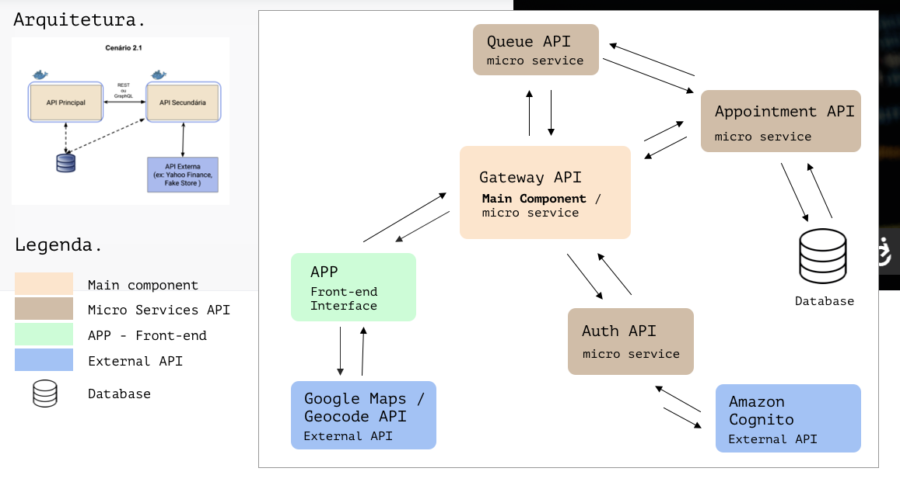

# MVP 3 PUC Rio - Micro Gateway API
 
---

# Overview

If you want, you can clone all mvp repositorys including this repository with the command: ```mkdir -p gateway-api micro-auth-api micro-appointments-api micro-queue-api app && git clone https://github.com/leonardopaiva/pucrio-mvp-des-fs-advanced-micro-gateway-api.git gateway-api && git clone https://github.com/leonardopaiva/pucrio-mvp-des-fs-advanced-micro-auth-api.git micro-auth-api && git clone https://github.com/leonardopaiva/pucrio-mvp-des-fs-advanced-micro-appointments-api.git micro-appointments-api && git clone https://github.com/leonardopaiva/pucrio-mvp-des-fs-advanced-micro-queue-api.git micro-queue-api && git clone https://github.com/leonardopaiva/pucrio-mvp-des-fs-advanced-app app```

Then cd to gateway-api folder and run ```docker-compose build up```

This is the main component of this MVP 3 from PUC Rio University, by student Leonardo Paiva. In this MVP, users can register appointments and work completely offline by saving their data in local storage when they are not connected to the internet. Later, they can access the action queue to synchronize their data in the database (using the micro-queue API and micro-appointments API). Users can register, update, delete, and view appointments in list view, map view (using the external Google Maps API), or on a calendar.

Upon launching the app, the user must sign up and authenticate (via the micro-auth API), so that the appointments will be saved under their user ID. After that, all operations can be done offline and synchronized with the cloud as soon as the user wishes.

The purpose of this micro-gateway-api is to consolidate information for all the microservices and the app. It should be used as a starting point and includes links to all of them, configuration details, and commands to clone them. 
 
This microservice is responsible for receiving all requests from the front-end and forwarding them to their respective microservices, thus acting as a gateway. It features routes for the following microservices: micro-auth-api (user login and registration), micro-queue-api (processing the synchronization queue for user data), and micro-appointments-api, to save the appointment data directly (CREATE, PUT, DELETE, GET)

***Access the port of this microservice and you will have a Swagger interface to perform operations without depending on the front-end. something like http://localhost:5050***
 
# Project Setup Instructions

**1. Configure Environment Variables**

- ***Rename the .env.demo file to .env***
- Set the values for the environment variables present in the file.  
  This is necessary because user authentication and registration are performed through Amazon Cognito.
- Create a user pool in Cognito (NOT necessary for mvp professors).  
  By accessing your user pool, you can retrieve the required variables:
  - User Pool ID
  - Client ID (found within App Clients)
  - Client Secret (found within App Clients)

**2. Clone the Repositories**

- Clone all the repositories into the root directory of the project.
- Each repository should be placed in its respective folder.
- You can name each folder as desired if you adjust the docker-compose.yml; however, as it is currently configured, the folders should be named as follows:
  - /gateway-api for the gateway
  - /micro-auth-api for the auth API
  - /micro-appointments-api for the appointments API
  - /micro-queue-api for the queue API
  - /app for the front-end app

Below is a command that will clone all the repositories and place them in their respective folders at once.

**3. Verify Docker Functionality and Run Containers**

Next, ensure that your Docker is working and that you are able to create containers. ***And make sure that the dist folder is inside app folder***, if not, run ```npm run pwa``` inside app folder.
If everything is set up correctly, run the following command:

    ```docker compose up --build```

This command will start all the microservices as well as the React-based front-end app.  
Check the docker-compose.yml file to see where each service is running, but the most important is the app running on port 8080.  
Depending on your container configuration, you can access the app at:

    ```http://localhost:8080```
 
## How to Run Only This Microservice
 
You must have all the Python libraries listed in requirements.txt installed.  
After cloning the repository, navigate to the root directory through the terminal to execute the commands below.
 
> It is strongly recommended to use virtual environments such as virtualenv (https://virtualenv.pypa.io/en/latest/installation.html).
 
```
(env)$ pip install -r 'requirements.txt'
```
 
This command installs the dependencies/libraries listed in the requirements.txt file.
 
To run the API, simply execute:
 
```
(env)$ flask run --host 0.0.0.0 --port 5000
```

or
 
```
(env)$ flask run --host 0.0.0.0 --port 5000 --reload
```

Open [http://localhost:5000/#/](http://localhost:5000/#/) in your browser to check the API status.

## Tests
when the containers are running, you can run this command in a separate terminal:  
```docker-compose exec micro-auth-api pytest -v tests/test_auth.py```   
```docker-compose exec micro-appointments-api pytest -v tests/test_appointments.py```   

# MVP Architecture



# Thanks to the MVP professors

Thanks to the MVP professors, Marisa Silva, Dieinison Braga and Carlos Rocha.
  
## About This Project
 
This is the third MVP of the Full Stack Development Postgraduate Program at PUCRS University, Rio de Janeiro.

**Componente Principal Gateway Api**: [https://github.com/leonardopaiva/pucrio-mvp-des-fs-advanced-micro-gateway-api](https://github.com/leonardopaiva/pucrio-mvp-des-fs-advanced-micro-gateway-api)  
**APP**: [https://github.com/leonardopaiva/pucrio-mvp-des-fs-advanced-app](https://github.com/leonardopaiva/pucrio-mvp-des-fs-advanced-app)  
**micro-auth-api**: [https://github.com/leonardopaiva/pucrio-mvp-des-fs-advanced-micro-auth-api](https://github.com/leonardopaiva/pucrio-mvp-des-fs-advanced-micro-auth-api)  
**micro-queue-api**: [https://github.com/leonardopaiva/pucrio-mvp-des-fs-advanced-micro-queue-api](https://github.com/leonardopaiva/pucrio-mvp-des-fs-advanced-micro-queue-api)  
**micro-appointments-api**: [https://github.com/leonardopaiva/pucrio-mvp-des-fs-advanced-micro-appointments-api](https://github.com/leonardopaiva/pucrio-mvp-des-fs-advanced-micro-appointments-api)  

 
**Student**: Leonardo Souza Paiva  
**Portfolio**: [www.leonardopaiva.com](http://www.leonardopaiva.com)
